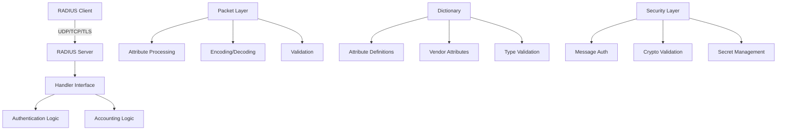

# GoRADIUS

A comprehensive Go library for implementing RADIUS (Remote Authentication Dial-In User Service) servers and clients according to RFC 2865, RFC 2866, and related specifications.

## Features

### Core RADIUS Protocol Support
- **RFC 2865**: Remote Authentication Dial-In User Service (RADIUS)
- **RFC 2866**: RADIUS Accounting
- **RFC 2868**: Tunnel Protocol Support (Tagged Attributes)
- **RFC 2869**: RADIUS Extensions
- Full packet encoding/decoding with validation
- Support for all standard RADIUS packet types
- Comprehensive attribute handling with type safety

### Transport Protocols
- **UDP**: Standard RADIUS transport (RFC 2865)

### Security Features
- Request/response authenticator calculation and verification
- User-Password encryption (RFC 2865)
- Tunnel-Password encryption (RFC 2868)
- Ascend-Secret encryption
- Cryptographic packet validation using MD5 (RFC required)

### Dictionary Support
- Efficient in-memory attribute dictionary system
- Fast O(1) attribute lookups by ID and name
- Support for vendor-specific attributes (VSAs)
- Type validation for all attribute types
- Tagged attribute support (RFC 2868)
- Enumerated value support
- Built-in RFC and vendor dictionaries (ERX, Ascend)

### Server Features
- Simple UDP RADIUS server
- Concurrent request handling with goroutines
- Flexible handler interface
- Per-client secret management
- Dictionary-based attribute validation

### Packet Features
- Low-level packet manipulation
- Attribute encoding/decoding helpers
- VSA (Vendor-Specific Attribute) support
- Tagged attribute handling
- Password encryption/decryption

## Definition of Done (SDK Goals)

GoRADIUS targets developers who need to ship RADIUS integrations without becoming protocol experts. The library is considered “done” when it delivers a batteries-included SDK for both server and client use cases with the following traits:

- **High-level server workflow**: Handlers receive already-parsed attribute sets, apply business rules, and send attributes back via a fluent response builder. Low-level details such as packet encoding, authenticators, retries, and dictionary lookups stay inside the library.
- **High-level client workflow**: Callers describe the attributes they want to send (e.g., Access-Request, Accounting-Request) and receive parsed attributes in return. Session management, retransmissions, and message authentication are handled automatically, so client code resembles `send attributes → wait for attributes`.
- **Protocol expertise optional**: Exhaustive dictionaries, sane defaults, guardrails, and validation should make it possible to build a RADIUS client or server while only thinking about the business domain (authorize a user, record accounting data, etc.).
- **Composable SDK building blocks**: Helpers, middleware hooks, and extensibility points should allow mixing low-level and high-level APIs as needed without leaking protocol complexity into business logic.

## Architecture



## Installation

```bash
go get github.com/vitalvas/goradius
```

## Quick Start

### Basic RADIUS Server

```go
package main

import (
    "fmt"
    "log"

    "github.com/vitalvas/goradius/pkg/dictionaries"
    "github.com/vitalvas/goradius/pkg/dictionary"
    "github.com/vitalvas/goradius/pkg/packet"
    "github.com/vitalvas/goradius/pkg/server"
)

type myHandler struct{}

func (h *myHandler) ServeSecret(req server.SecretRequest) (server.SecretResponse, error) {
    // Return shared secret for this client
    return server.SecretResponse{
        Secret: []byte("testing123"),
    }, nil
}

func (h *myHandler) ServeRADIUS(req *server.Request) (server.Response, error) {
    fmt.Printf("Received %s from %s\n", req.Packet.Code.String(), req.RemoteAddr)

    resp := server.NewResponse(req)

    // Set response code based on request type
    switch req.Packet.Code {
    case packet.CodeAccessRequest:
        resp.SetCode(packet.CodeAccessAccept)
        resp.SetAttribute("Reply-Message", "Access granted")
    case packet.CodeAccountingRequest:
        resp.SetCode(packet.CodeAccountingResponse)
    }

    return resp, nil
}

func main() {
    // Create dictionary with standard attributes
    dict := dictionary.New()
    dict.AddStandardAttributes(dictionaries.StandardRFCAttributes)

    // Create and start server
    srv, err := server.New(":1812", &myHandler{}, dict)
    if err != nil {
        log.Fatal(err)
    }

    fmt.Println("RADIUS server listening on :1812")
    log.Fatal(srv.Serve())
}
```

## Package Structure

### Core Packages

- **`pkg/packet`**: RADIUS packet encoding, decoding, and attribute handling
- **`pkg/server`**: Simple RADIUS UDP server implementation
- **`pkg/dictionary`**: In-memory attribute dictionary with fast lookups
- **`pkg/dictionaries`**: Built-in RFC and vendor dictionary definitions
- **`pkg/crypto`**: Message authenticator and validation functions
- **`pkg/log`**: Logging interface

### Key Components

#### Packet Processing (pkg/packet)
- Packet encoding/decoding (Encode/Decode)
- Attribute creation and manipulation
- Vendor-Specific Attribute (VSA) support
- Tagged attribute handling
- Value encoding/decoding helpers
- Authenticator calculation
- Password encryption (User-Password, Tunnel-Password, Ascend-Secret)

#### Dictionary System (pkg/dictionary)
- Fast O(1) lookups by attribute ID or name
- Vendor attribute lookups
- Standard RFC attributes
- Vendor-specific attributes
- Data type definitions
- Encryption type support
- Enumerated values

#### Server (pkg/server)
- UDP RADIUS server
- Handler interface for request processing
- Secret management per client
- Response helper functions

#### Built-in Dictionaries (pkg/dictionaries)
- Standard RFC attributes (RFC 2865, 2866, etc.)
- Juniper ERX vendor attributes
- Ascend vendor attributes

## Usage Examples

### Creating Packets with Dictionary

```go
// Create dictionary
dict := dictionary.New()
dict.AddStandardAttributes(dictionaries.StandardRFCAttributes)
dict.AddVendor(dictionaries.ERXVendorDefinition)

// Create packet with dictionary
req := packet.NewWithDictionary(packet.CodeAccessRequest, 1, dict)

// Add attributes by name
req.AddAttributeByName("User-Name", "john.doe")
req.AddAttributeByName("Framed-IP-Address", "192.0.2.11")
req.AddAttributeByName("ERX-Primary-Dns", "8.8.8.8")

// Add tagged vendor attribute
req.AddAttributeByName("ERX-Service-Activate:1", "ipoe-parking")
```

### Working with VSAs

```go
// Create vendor attribute
va := packet.NewVendorAttribute(4874, 13, []byte("8.8.8.8"))
req.AddVendorAttribute(va)

// Get vendor attribute
va, found := req.GetVendorAttribute(4874, 13)
if found {
    fmt.Printf("Value: %s\n", string(va.Value))
}
```

## Testing

Run tests:

```bash
go test ./...
```

Run tests with race detection:

```bash
go test -race ./...
```

Run tests with coverage:

```bash
go test -cover ./...
```

## Building

Format code:

```bash
go fmt ./...
```

Vet code:

```bash
go vet ./...
```

Run linter:

```bash
golangci-lint run
```

## Dependencies

- **Go 1.23** or later
- **github.com/sirupsen/logrus** - Structured logging
- **github.com/stretchr/testify** - Testing framework

## Standards Compliance

This library implements the following RFCs:

- **RFC 2865**: Remote Authentication Dial-In User Service (RADIUS)
- **RFC 2866**: RADIUS Accounting
- **RFC 2868**: RADIUS Attributes for Tunnel Protocol Support
- **RFC 2869**: RADIUS Extensions

## Performance

- Concurrent request handling with goroutines
- Efficient O(1) dictionary lookups using hash maps
- Memory-efficient packet encoding/decoding
- Pre-allocated attribute structures

## Security Considerations

- **MD5 Usage**: This library uses MD5 for RADIUS authenticator calculation as required by RFC 2865. While MD5 is cryptographically weak, it is mandated by the RADIUS specification.
- **Shared Secrets**: Always use strong, random shared secrets (minimum 16 characters recommended)
- **Password Encryption**: User passwords are encrypted using the RFC-specified algorithm when using dictionary-based attribute methods
- **Network Security**: RADIUS transmits over UDP without built-in transport encryption. Use network-level security (VPN, private networks) for production deployments
- **Input Validation**: All packet decoding includes length and structure validation to prevent malformed packet attacks

## Project Status

This is an active RADIUS library implementation with the following status:

**Implemented:**
- ✅ RADIUS packet encoding/decoding
- ✅ Standard attribute handling
- ✅ Vendor-Specific Attributes (VSAs)
- ✅ Dictionary system with fast lookups
- ✅ UDP server
- ✅ Password encryption (User-Password, Tunnel-Password, Ascend-Secret)
- ✅ Tagged attributes (RFC 2868)
- ✅ Authenticator calculation and verification

**Not Yet Implemented:**
- ❌ TCP transport
- ❌ TLS support
- ❌ RADIUS client
- ❌ Message-Authenticator attribute (RFC 2869)
- ❌ Dynamic Authorization (CoA/Disconnect) - RFC 3576
- ❌ EAP support

## Examples

See `cmd/simple-server/main.go` for a working example of a basic RADIUS server.

## Documentation

Detailed documentation is available in the `docs/` directory:
- [Dictionary Usage](docs/docs/dictionary.md)
- [Packet Handling](docs/docs/packets.md)

## License

This project follows standard Go module licensing practices. Please refer to the project repository for specific license information.
