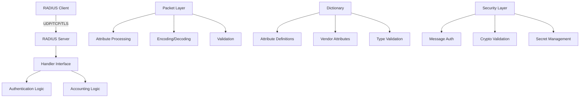

# GoRADIUS

A comprehensive Go library for implementing RADIUS (Remote Authentication Dial-In User Service) servers and clients according to RFC 2865, RFC 2866, and related specifications.

## Features

### Core RADIUS Protocol Support
- **RFC 2865**: Remote Authentication Dial-In User Service (RADIUS)
- **RFC 2866**: RADIUS Accounting
- **RFC 3576**: Dynamic Authorization Extensions (CoA/Disconnect)
- Full packet encoding/decoding with validation
- Support for all standard RADIUS packet types
- Comprehensive attribute handling with type safety

### Transport Protocols
- **UDP**: Standard RADIUS transport (RFC 2865)
- **TCP**: TCP transport for RADIUS
- **TLS over TCP**: Secure RADIUS communication
- Configurable timeouts and retry mechanisms
- Connection pooling for TCP connections

### Security Features
- Message authenticator validation (RFC 2869)
- Cryptographic packet validation
- Request/response authenticator verification
- Secure secret management
- Protection against replay attacks

### Dictionary Support
- Extensible attribute dictionary system
- YAML-based dictionary configuration
- Support for vendor-specific attributes (VSAs)
- Type validation for all attribute types
- Custom attribute definitions

### Server Features
- High-performance concurrent request handling
- Middleware support for request processing
- Flexible handler interface
- Client validation and access control
- Request lifecycle management
- Statistics and monitoring
- Graceful shutdown support

### Client Features
- Automatic failover between multiple servers
- Connection pooling and reuse
- Retry logic with exponential backoff
- Accounting support
- Health checking
- High-level API for common operations

## Architecture



## Installation

```bash
go get github.com/vitalvas/goradius
```

## Quick Start

### Basic RADIUS Server

```go
package main

import (
    "context"
    "log"
    
    "github.com/vitalvas/goradius/pkg/server"
    "github.com/vitalvas/goradius/pkg/packet"
)

func main() {
    // Create server configuration
    config := &server.Config{
        Bindings: []server.Binding{
            {
                Network: "udp",
                Address: ":1812",
            },
        },
    }
    
    // Create and start server
    srv, err := server.New(config, &MyHandler{})
    if err != nil {
        log.Fatal(err)
    }
    
    if err := srv.Start(context.Background()); err != nil {
        log.Fatal(err)
    }
}

type MyHandler struct{}

func (h *MyHandler) HandleRequest(ctx context.Context, req *packet.Packet) (*packet.Packet, error) {
    // Handle authentication request
    if req.Code == packet.CodeAccessRequest {
        // Validate credentials and return appropriate response
        resp := packet.New(packet.CodeAccessAccept, req.Identifier)
        return resp, nil
    }
    return nil, nil
}
```

### Basic RADIUS Client

```go
package main

import (
    "context"
    "log"
    
    "github.com/vitalvas/goradius/pkg/client"
    "github.com/vitalvas/goradius/pkg/packet"
)

func main() {
    // Create client configuration
    config := &client.Config{
        Servers: []client.ServerConfig{
            {
                Address: "localhost:1812",
                Secret:  "testing123",
            },
        },
        Transport: client.TransportUDP,
    }
    
    // Create client
    c, err := client.New(config)
    if err != nil {
        log.Fatal(err)
    }
    defer c.Close()
    
    // Create authentication request
    req := packet.New(packet.CodeAccessRequest, 1)
    // Add attributes...
    
    // Send request
    resp, err := c.SendRequest(context.Background(), req)
    if err != nil {
        log.Fatal(err)
    }
    
    log.Printf("Response: %v", resp.Code)
}
```

## Package Structure

### Core Packages

- **`pkg/packet`**: RADIUS packet encoding, decoding, and validation
- **`pkg/server`**: RADIUS server implementation with UDP/TCP support
- **`pkg/client`**: RADIUS client with failover and retry capabilities
- **`pkg/dictionary`**: Attribute dictionary management and validation
- **`pkg/crypto`**: Cryptographic functions and message authentication
- **`pkg/log`**: Logging interface and utilities

### Key Components

#### Packet Processing
- Packet encoding/decoding according to RFC specifications
- Attribute type validation and conversion
- Authenticator calculation and verification
- Support for all standard RADIUS packet types

#### Dictionary System
- YAML-based attribute definitions
- Vendor-specific attribute support
- Type-safe attribute handling
- Extensible dictionary loading

#### Security
- Message authenticator support (RFC 2869)
- Request/response authenticator validation
- Secure random number generation
- Protection against common attacks

## Configuration

### Server Configuration

```go
config := &server.Config{
    Bindings: []server.Binding{
        {
            Network: "udp",
            Address: ":1812",
            Secret:  "shared-secret",
        },
        {
            Network: "tcp",
            Address: ":1812",
            TLSConfig: &tls.Config{...},
        },
    },
    ReadTimeout:    time.Second * 5,
    WriteTimeout:   time.Second * 5,
    MaxRequestSize: 4096,
}
```

### Client Configuration

```go
config := &client.Config{
    Servers: []client.ServerConfig{
        {
            Address: "radius1.example.com:1812",
            Secret:  "secret1",
        },
        {
            Address: "radius2.example.com:1812", 
            Secret:  "secret2",
        },
    },
    Transport:       client.TransportUDP,
    Timeout:         time.Second * 5,
    MaxRetries:      3,
    RetryInterval:   time.Second * 2,
    FailoverTimeout: time.Second * 30,
}
```

## Testing

Run the full test suite with race detection:

```bash
make test
```

Run tests without race detection (faster for development):

```bash
make test-fast
```

## Building

Build all binaries:

```bash
make build
```

Run all checks (format, vet, lint, test):

```bash
make check
```

## Dependencies

- **Go 1.24.4** or later
- **github.com/sirupsen/logrus** - Structured logging
- **github.com/stretchr/testify** - Testing framework
- **golang.org/x/crypto** - Cryptographic functions
- **gopkg.in/yaml.v3** - YAML parsing for dictionaries

## Standards Compliance

This library implements the following RFCs:

- **RFC 2865**: Remote Authentication Dial-In User Service (RADIUS)
- **RFC 2866**: RADIUS Accounting
- **RFC 2869**: RADIUS Extensions (Message Authenticator)
- **RFC 3576**: Dynamic Authorization Extensions to RADIUS

## Performance

- Concurrent request handling with goroutine pools
- Connection pooling for TCP transport
- Efficient packet encoding/decoding
- Memory-efficient attribute handling
- Configurable timeouts and limits

## Security Considerations

- Always use strong shared secrets
- Enable message authenticator for additional security
- Consider using TLS for transport security
- Implement proper access controls in handlers
- Regular security audits and updates

## License

This project follows standard Go module licensing practices. Please refer to the project repository for specific license information.

## Contributing

1. Fork the repository
2. Create a feature branch
3. Make changes with appropriate tests
4. Ensure all tests pass: `make check`
5. Submit a pull request

## Support

For issues, feature requests, or questions, please refer to the project repository.