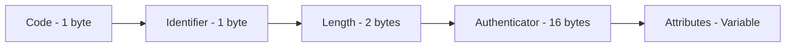

# RADIUS Packet Handling

This guide covers how to work with RADIUS packets, attributes, and encoding/decoding in the GoRADIUS library.

## Packet Structure

RADIUS packets follow the structure defined in RFC 2865:



### Packet Fields

- **Code**: Identifies the packet type (Access-Request, Access-Accept, etc.)
- **Identifier**: Unique identifier for matching requests and responses
- **Length**: Total length of the packet in bytes
- **Authenticator**: 16-byte field for authentication and integrity
- **Attributes**: Variable-length attribute-value pairs

## Creating Packets

### Basic Packet Creation

```go
import "github.com/vitalvas/goradius/pkg/packet"

// Create a new Access-Request packet
req := packet.New(packet.CodeAccessRequest, 1)

// Create a response packet
resp := packet.New(packet.CodeAccessAccept, req.Identifier)
```

### Packet Codes

```go
// Authentication packets
packet.CodeAccessRequest     // 1
packet.CodeAccessAccept      // 2
packet.CodeAccessReject      // 3
packet.CodeAccessChallenge   // 11

// Accounting packets
packet.CodeAccountingRequest  // 4
packet.CodeAccountingResponse // 5

// Status packets
packet.CodeStatusServer      // 12
packet.CodeStatusClient      // 13

// Dynamic Authorization (CoA/Disconnect)
packet.CodeDisconnectRequest // 40
packet.CodeDisconnectACK     // 41
packet.CodeDisconnectNAK     // 42
packet.CodeCoARequest        // 43
packet.CodeCoAACK           // 44
packet.CodeCoANAK           // 45
```

## Working with Attributes

### Adding Attributes with Dictionary

The recommended way to work with attributes is using the dictionary-based API:

```go
import (
    "github.com/vitalvas/goradius/pkg/packet"
    "github.com/vitalvas/goradius/pkg/dictionaries"
)

// Create packet with dictionary
dict := dictionaries.NewDefault()
req := packet.NewWithDictionary(packet.CodeAccessRequest, 1, dict)

// Add attributes by name - type-safe and automatic encoding
req.AddAttributeByName("User-Name", "john.doe")
req.AddAttributeByName("NAS-IP-Address", "192.168.1.1")
req.AddAttributeByName("NAS-Port", 123)
req.AddAttributeByName("Framed-IP-Address", "10.0.0.100")
req.AddAttributeByName("Session-Timeout", 3600)

// Tagged attributes use colon notation
req.AddAttributeByName("Tunnel-Type:1", "VLAN")
req.AddAttributeByName("Tunnel-Medium-Type:1", "IEEE-802")
```

### Retrieving Attributes

```go
// Get attribute by name - returns all values for that attribute
usernames := req.GetAttribute("User-Name")
if len(usernames) > 0 {
    fmt.Printf("Username: %s\n", usernames[0].String())
}

// Get multiple values (for attributes that support arrays)
replyMessages := req.GetAttribute("Reply-Message")
for _, msg := range replyMessages {
    fmt.Printf("Reply: %s\n", msg.String())
}

// Get vendor attribute by name
dnsServers := req.GetAttribute("ERX-Primary-Dns")
if len(dnsServers) > 0 {
    fmt.Printf("Primary DNS: %s\n", dnsServers[0].String())
}

// Get tagged attributes
tunnelTypes := req.GetAttribute("Tunnel-Type")
for _, tunnelType := range tunnelTypes {
    if tunnelType.Tag > 0 {
        fmt.Printf("Tunnel Type (Tag %d): %s\n", tunnelType.Tag, tunnelType.String())
    }
}

// List all attribute names in the packet
attrNames := req.ListAttributes()
for _, name := range attrNames {
    fmt.Printf("Attribute: %s\n", name)
}
```

### Working with Attribute Values

The dictionary API automatically handles encoding and decoding based on attribute type:

```go
// AttributeValue provides type-safe access to attribute data
attrs := req.GetAttribute("User-Name")
if len(attrs) > 0 {
    // String() method works for all attribute types
    fmt.Printf("Username: %s\n", attrs[0].String())

    // Access metadata
    fmt.Printf("Attribute type ID: %d\n", attrs[0].Type)
    fmt.Printf("Data type: %s\n", attrs[0].DataType)
    fmt.Printf("Is VSA: %t\n", attrs[0].IsVSA)
}
```

## Standard Attributes

Common RADIUS attribute types (use with dictionary for names or reference):

```go
// Common attribute types
const (
    AttributeUserName             = 1
    AttributeUserPassword         = 2
    AttributeCHAPPassword         = 3
    AttributeNASIPAddress         = 4
    AttributeNASPort              = 5
    AttributeServiceType          = 6
    AttributeFramedProtocol       = 7
    AttributeFramedIPAddress      = 8
    AttributeFramedIPNetmask      = 9
    AttributeFramedRouting        = 10
    AttributeReplyMessage         = 18
    AttributeState                = 24
    AttributeVendorSpecific       = 26
    AttributeSessionTimeout       = 27
    AttributeIdleTimeout          = 28
    AttributeCallingStationID     = 31
    AttributeCalledStationID      = 30
    AttributeNASIdentifier        = 32
    AttributeAcctStatusType       = 40
    AttributeAcctInputOctets      = 42
    AttributeAcctOutputOctets     = 43
    AttributeAcctSessionID        = 44
    AttributeAcctSessionTime      = 46
    AttributeAcctInputPackets     = 47
    AttributeAcctOutputPackets    = 48
    AttributeAcctTerminateCause   = 49
    AttributeEventTimestamp       = 55
    AttributeNASPortType          = 61
)
```

### Example Usage with Dictionary

```go
// Create packet with dictionary
dict := dictionaries.NewDefault()
req := packet.NewWithDictionary(packet.CodeAccessRequest, 1, dict)

// User credentials - use attribute names instead of IDs
req.AddAttributeByName("User-Name", "john.doe")
req.AddAttributeByName("User-Password", "secret123")  // Will be encrypted automatically

// NAS information
req.AddAttributeByName("NAS-IP-Address", "192.168.1.1")
req.AddAttributeByName("NAS-Port", 123)
req.AddAttributeByName("NAS-Identifier", "nas-gateway-01")

// Session information
req.AddAttributeByName("Framed-IP-Address", "10.0.0.100")
req.AddAttributeByName("Session-Timeout", 3600)

// Accounting
req.AddAttributeByName("Acct-Status-Type", "Start")  // Uses enumerated value
req.AddAttributeByName("Acct-Input-Octets", 1024000)
req.AddAttributeByName("Acct-Output-Octets", 2048000)
```

## Vendor-Specific Attributes

### Adding VSAs with Dictionary

The recommended way to work with vendor-specific attributes is using the dictionary API:

```go
// Add vendor attributes by name - dictionary handles VSA encoding automatically
req.AddAttributeByName("ERX-Primary-Dns", "8.8.8.8")
req.AddAttributeByName("ERX-Secondary-Dns", "8.8.4.4")

// Tagged vendor attributes use colon notation
req.AddAttributeByName("ERX-Service-Activate:1", "ipoe-parking")
req.AddAttributeByName("ERX-Service-Activate:2", "svc-ipoe-policer(52428800, 52428800)")

// The library automatically:
// - Looks up the vendor ID (e.g., 4874 for ERX)
// - Encodes the VSA with proper structure
// - Handles tagging if the attribute supports it
```

### Retrieving VSAs

Use the high-level dictionary API to retrieve vendor attributes by name:

```go
// Get vendor attribute by name - no need to know vendor IDs
dnsServers := req.GetAttribute("ERX-Primary-Dns")
if len(dnsServers) > 0 {
    fmt.Printf("Primary DNS: %s\n", dnsServers[0].String())

    // Access VSA metadata if needed
    fmt.Printf("Vendor ID: %d\n", dnsServers[0].VendorID)
    fmt.Printf("Vendor Type: %d\n", dnsServers[0].VendorType)
}

// Get all vendor attributes (including tagged ones)
services := req.GetAttribute("ERX-Service-Activate")
for _, svc := range services {
    if svc.Tag > 0 {
        fmt.Printf("Service (Tag %d): %s\n", svc.Tag, svc.String())
    } else {
        fmt.Printf("Service: %s\n", svc.String())
    }
}

// List all attributes including VSAs
attrNames := req.ListAttributes()
for _, name := range attrNames {
    fmt.Printf("Attribute: %s\n", name)
}
```

## Packet Encoding and Decoding

### Encoding Packets

**Note: When using the server package, encoding is handled automatically. This section describes low-level packet operations for advanced use cases.**

```go
// Create packet with dictionary
dict := dictionaries.NewDefault()
req := packet.NewWithDictionary(packet.CodeAccessRequest, 1, dict)

// Add attributes using dictionary API
req.AddAttributeByName("User-Name", "john.doe")
req.AddAttributeByName("NAS-IP-Address", "192.168.1.1")

// Generate random authenticator for request packets
rand.Read(req.Authenticator[:])

// Encode packet to bytes (done automatically by server layer)
data, err := req.Encode()
if err != nil {
    log.Fatal("Failed to encode packet:", err)
}

fmt.Printf("Encoded packet: %x\n", data)
```

### Decoding Packets

**Note: When using the server package, decoding is handled automatically and packets are provided with a dictionary already attached.**

```go
// Decode packet from bytes (done automatically by server layer)
pkt, err := packet.Decode(data)
if err != nil {
    log.Fatal("Failed to decode packet:", err)
}

// Attach dictionary for high-level attribute access
dict := dictionaries.NewDefault()
pkt.Dict = dict

// Now you can use dictionary API
usernames := pkt.GetAttribute("User-Name")
if len(usernames) > 0 {
    fmt.Printf("Username: %s\n", usernames[0].String())
}
```

### Packet Validation

```go
// Validate packet structure
if err := req.IsValid(); err != nil {
    log.Printf("Invalid packet: %v", err)
}

// Check packet code
if !req.Code.IsValid() {
    log.Printf("Invalid packet code")
}

// Validate packet length
if req.Length < packet.MinPacketLength || req.Length > packet.MaxPacketLength {
    log.Printf("Invalid packet length: %d", req.Length)
}
```

### Authenticator Calculation

**Note: These methods are marked INTERNAL and should not be used in application code. The server layer handles authenticator calculation automatically.**

For advanced use cases requiring direct authenticator manipulation, these low-level methods are available but discouraged:
- `CalculateRequestAuthenticator()` - INTERNAL use only
- `CalculateResponseAuthenticator()` - INTERNAL use only
- `SetAuthenticator()` - INTERNAL use only

When using the server package, authenticators are calculated and validated automatically.

### Request/Response Matching

When using the server package, responses are automatically created with matching identifiers:

```go
// In your handler
func (h *myHandler) ServeRADIUS(req *server.Request) (server.Response, error) {
    // NewResponse automatically matches the request identifier
    resp := server.NewResponse(req)

    // Set response code and attributes
    resp.SetCode(packet.CodeAccessAccept)
    resp.SetAttribute("Reply-Message", "Access granted")

    // Authenticators are calculated automatically before sending
    return resp, nil
}
```

### Packet Information

```go
// Get packet size
fmt.Printf("Packet size: %d bytes\n", req.Length)

// Count attributes
fmt.Printf("Number of attributes: %d\n", len(req.Attributes))

// Print packet info
fmt.Println(req.String())
// Output: Code=Access-Request(1), ID=1, Length=40, Attributes=2
```

## Packet Security

### Password Encryption

Password encryption is handled automatically when using the dictionary API. The library supports multiple encryption types defined in the dictionary:

```go
// User-Password encryption (RFC 2865) - handled automatically
secret := []byte("testing123")
authenticator := req.Authenticator
req.AddAttributeByNameWithSecret("User-Password", "secret123", secret, authenticator)

// Tunnel-Password encryption (RFC 2868) - handled automatically
req.AddAttributeByNameWithSecret("Tunnel-Password:1", "tunnel-secret", secret, authenticator)

// Ascend-Secret encryption - handled automatically
req.AddAttributeByNameWithSecret("Ascend-Secret", "ascend-secret", secret, authenticator)

// The dictionary determines the encryption type based on the attribute definition
// You don't need to specify the encryption algorithm manually
```

**Note:** Direct encryption functions like `EncryptAttributeValue()` are low-level APIs for advanced use. The dictionary-based methods are recommended for application code.

## Error Handling

### Packet Validation Errors

```go
func validatePacket(data []byte) error {
    // Check minimum packet length
    if len(data) < packet.MinPacketLength {
        return fmt.Errorf("packet too short: %d bytes", len(data))
    }

    // Check maximum packet length
    if len(data) > packet.MaxPacketLength {
        return fmt.Errorf("packet too long: %d bytes", len(data))
    }

    // Decode and validate
    pkt, err := packet.Decode(data)
    if err != nil {
        return fmt.Errorf("decode failed: %w", err)
    }

    if err := pkt.IsValid(); err != nil {
        return fmt.Errorf("validation failed: %w", err)
    }

    return nil
}
```

### Attribute Parsing Errors

```go
func safeGetAttribute(req *packet.Packet, attrType uint8) (string, error) {
    attr, found := req.GetAttribute(attrType)
    if !found {
        return "", fmt.Errorf("attribute %d not found", attrType)
    }

    if len(attr.Value) == 0 {
        return "", fmt.Errorf("attribute %d has empty value", attrType)
    }

    return string(attr.Value), nil
}
```

### VSA Parsing Errors

```go
func safeParseVSA(attr *packet.Attribute) (*packet.VendorAttribute, error) {
    if attr.Type != 26 {
        return nil, fmt.Errorf("not a VSA attribute (type %d)", attr.Type)
    }

    va, err := packet.ParseVSA(attr)
    if err != nil {
        return nil, fmt.Errorf("failed to parse VSA: %w", err)
    }

    return va, nil
}
```

## Best Practices

### Packet Creation

1. **Use appropriate packet codes** for request types
2. **Set random authenticators** for Access-Request packets
3. **Match identifiers** between requests and responses
4. **Validate packets** before and after encoding/decoding

### Attribute Handling

1. **Use dictionaries** for named attribute access when possible
2. **Check attribute existence** before accessing values
3. **Handle encoding errors** for IP addresses and other typed values
4. **Use tagged attributes** correctly for tunnel attributes

### Security

1. **Always use secrets** for authenticator calculation
2. **Encrypt passwords** using appropriate methods (User-Password, Tunnel-Password)
3. **Validate packet length** to prevent buffer overflows
4. **Use Message-Authenticator** for enhanced security (EAP and other sensitive operations)

### Performance

1. **Pre-allocate attribute slices** for known packet structures
2. **Reuse packets** when processing many requests (clear and reuse)
3. **Avoid unnecessary encoding/decoding** cycles
4. **Use efficient attribute lookups** by type instead of iteration
