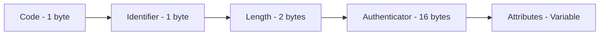

# RADIUS Packet Handling

This guide covers how to work with RADIUS packets, attributes, and encoding/decoding in the GoRADIUS library.

## Packet Structure

RADIUS packets follow the structure defined in RFC 2865:



### Packet Fields

- **Code**: Identifies the packet type (Access-Request, Access-Accept, etc.)
- **Identifier**: Unique identifier for matching requests and responses
- **Length**: Total length of the packet in bytes
- **Authenticator**: 16-byte field for authentication and integrity
- **Attributes**: Variable-length attribute-value pairs

## Creating Packets

### Basic Packet Creation

```go
import "github.com/vitalvas/goradius/pkg/packet"

// Create a new Access-Request packet
req := packet.New(packet.CodeAccessRequest, 1)

// Create a response packet
resp := packet.New(packet.CodeAccessAccept, req.Identifier)
```

### Packet Codes

```go
// Authentication packets
packet.CodeAccessRequest     // 1
packet.CodeAccessAccept      // 2
packet.CodeAccessReject      // 3
packet.CodeAccessChallenge   // 11

// Accounting packets
packet.CodeAccountingRequest  // 4
packet.CodeAccountingResponse // 5

// Status packets
packet.CodeStatusServer      // 12
packet.CodeStatusClient      // 13

// Dynamic Authorization (CoA/Disconnect)
packet.CodeDisconnectRequest // 40
packet.CodeDisconnectACK     // 41
packet.CodeDisconnectNAK     // 42
packet.CodeCoARequest        // 43
packet.CodeCoAACK           // 44
packet.CodeCoANAK           // 45
```

## Working with Attributes

### Adding Attributes

```go
req := packet.New(packet.CodeAccessRequest, 1)

// Create and add raw attributes
attr := packet.NewAttribute(1, []byte("john.doe")) // User-Name
req.AddAttribute(attr)

// Using encoding helpers
attr = packet.NewAttribute(4, packet.EncodeIPAddr(net.ParseIP("192.168.1.1"))) // NAS-IP-Address
req.AddAttribute(attr)

attr = packet.NewAttribute(5, packet.EncodeInteger(123)) // NAS-Port
req.AddAttribute(attr)

// Binary/bytes attributes
attr = packet.NewAttribute(24, []byte{0x01, 0x02, 0x03}) // State
req.AddAttribute(attr)

// Date/time attributes
attr = packet.NewAttribute(55, packet.EncodeDate(time.Now())) // Event-Timestamp
req.AddAttribute(attr)

// Tagged attributes (for tunnel attributes)
taggedAttr := packet.NewTaggedAttribute(64, 1, []byte("example")) // Tunnel-Type with tag 1
req.AddAttribute(taggedAttr)
```

### Retrieving Attributes

```go
// Get first attribute of a type
attr, found := req.GetAttribute(1) // User-Name
if found {
    username := packet.DecodeString(attr.Value)
    fmt.Printf("Username: %s\n", username)
}

// Get all attributes of a type
attrs := req.GetAttributes(1) // All User-Name attributes
for _, attr := range attrs {
    fmt.Printf("User: %s\n", string(attr.Value))
}

// Decode typed values
attr, found = req.GetAttribute(5) // NAS-Port
if found {
    port, err := packet.DecodeInteger(attr.Value)
    if err == nil {
        fmt.Printf("NAS Port: %d\n", port)
    }
}

attr, found = req.GetAttribute(4) // NAS-IP-Address
if found {
    ip, err := packet.DecodeIPAddr(attr.Value)
    if err == nil {
        fmt.Printf("NAS IP: %s\n", ip.String())
    }
}

// Iterate through all attributes
for _, attr := range req.Attributes {
    if attr.Tag != 0 {
        fmt.Printf("Type: %d, Tag: %d, Value: %x\n", attr.Type, attr.Tag, attr.GetValue())
    } else {
        fmt.Printf("Type: %d, Value: %x\n", attr.Type, attr.Value)
    }
}
```

### Attribute Helper Functions

```go
// String encoding/decoding
value := packet.EncodeString("john.doe")
username := packet.DecodeString(value)

// Integer encoding/decoding
value = packet.EncodeInteger(uint32(123))
number, err := packet.DecodeInteger(value)

// IP address encoding/decoding
value, err = packet.EncodeIPAddr(net.ParseIP("192.168.1.1"))
ip, err := packet.DecodeIPAddr(value)

// IPv6 address encoding/decoding
value, err = packet.EncodeIPv6Addr(net.ParseIP("2001:db8::1"))
ip, err = packet.DecodeIPv6Addr(value)

// Date encoding/decoding
value = packet.EncodeDate(time.Now())
timestamp, err := packet.DecodeDate(value)

// Octets (raw bytes)
value = packet.EncodeOctets([]byte{0x01, 0x02, 0x03})
data := packet.DecodeOctets(value)
```

## Standard Attributes

Common RADIUS attribute types (use with dictionary for names or reference):

```go
// Common attribute types
const (
    AttributeUserName             = 1
    AttributeUserPassword         = 2
    AttributeCHAPPassword         = 3
    AttributeNASIPAddress         = 4
    AttributeNASPort              = 5
    AttributeServiceType          = 6
    AttributeFramedProtocol       = 7
    AttributeFramedIPAddress      = 8
    AttributeFramedIPNetmask      = 9
    AttributeFramedRouting        = 10
    AttributeReplyMessage         = 18
    AttributeState                = 24
    AttributeVendorSpecific       = 26
    AttributeSessionTimeout       = 27
    AttributeIdleTimeout          = 28
    AttributeCallingStationID     = 31
    AttributeCalledStationID      = 30
    AttributeNASIdentifier        = 32
    AttributeAcctStatusType       = 40
    AttributeAcctInputOctets      = 42
    AttributeAcctOutputOctets     = 43
    AttributeAcctSessionID        = 44
    AttributeAcctSessionTime      = 46
    AttributeAcctInputPackets     = 47
    AttributeAcctOutputPackets    = 48
    AttributeAcctTerminateCause   = 49
    AttributeEventTimestamp       = 55
    AttributeNASPortType          = 61
)
```

### Example Usage

```go
// User credentials
req.AddAttribute(packet.NewAttribute(1, []byte("john.doe")))              // User-Name
req.AddAttribute(packet.NewAttribute(2, []byte("encrypted-password")))    // User-Password

// NAS information
req.AddAttribute(packet.NewAttribute(4, packet.EncodeIPAddr(net.ParseIP("192.168.1.1")))) // NAS-IP-Address
req.AddAttribute(packet.NewAttribute(5, packet.EncodeInteger(123)))       // NAS-Port
req.AddAttribute(packet.NewAttribute(32, []byte("nas-gateway-01")))       // NAS-Identifier

// Session information
req.AddAttribute(packet.NewAttribute(8, packet.EncodeIPAddr(net.ParseIP("10.0.0.100")))) // Framed-IP-Address
req.AddAttribute(packet.NewAttribute(27, packet.EncodeInteger(3600)))     // Session-Timeout

// Accounting
req.AddAttribute(packet.NewAttribute(40, packet.EncodeInteger(1)))        // Acct-Status-Type (Start)
req.AddAttribute(packet.NewAttribute(42, packet.EncodeInteger(1024000)))  // Acct-Input-Octets
req.AddAttribute(packet.NewAttribute(43, packet.EncodeInteger(2048000)))  // Acct-Output-Octets
```

## Vendor-Specific Attributes

### Creating VSAs

```go
// Create a vendor-specific attribute
va := packet.NewVendorAttribute(
    4874,                  // Vendor ID (e.g., Juniper ERX)
    13,                    // Vendor attribute type
    []byte("8.8.8.8"),     // Value
)

// Convert to standard VSA attribute (Type 26)
vsaAttr := va.ToVSA()
req.AddAttribute(vsaAttr)

// Or add directly
req.AddVendorAttribute(va)

// Tagged vendor attributes
taggedVA := packet.NewTaggedVendorAttribute(
    4874,                  // Vendor ID
    1,                     // Vendor attribute type
    1,                     // Tag
    []byte("ipoe-parking"), // Value
)
req.AddVendorAttribute(taggedVA)
```

### Parsing VSAs

```go
// Get vendor attribute by IDs
va, found := req.GetVendorAttribute(4874, 13)
if found {
    fmt.Printf("Vendor ID: %d, Type: %d, Value: %s\n",
        va.VendorID, va.VendorType, string(va.Value))
}

// Get all vendor attributes of a type
vas := req.GetVendorAttributes(4874, 1)
for _, va := range vas {
    if va.Tag != 0 {
        fmt.Printf("Vendor attr with tag %d: %s\n", va.Tag, string(va.GetValue()))
    } else {
        fmt.Printf("Vendor attr: %s\n", string(va.Value))
    }
}

// Parse VSA from Type 26 attribute
attr, found := req.GetAttribute(26) // Vendor-Specific
if found {
    va, err := packet.ParseVSA(attr)
    if err == nil {
        fmt.Printf("Vendor ID: %d, Type: %d\n", va.VendorID, va.VendorType)
    }
}
```

## Packet Encoding and Decoding

### Encoding Packets

```go
// Create packet
req := packet.New(packet.CodeAccessRequest, 1)
req.AddAttribute(packet.NewAttribute(1, []byte("john.doe")))

// Generate random authenticator for request packets
rand.Read(req.Authenticator[:])

// Encode packet to bytes
data, err := req.Encode()
if err != nil {
    log.Fatal("Failed to encode packet:", err)
}

fmt.Printf("Encoded packet: %x\n", data)
```

### Decoding Packets

```go
// Decode packet from bytes
pkt, err := packet.Decode(data)
if err != nil {
    log.Fatal("Failed to decode packet:", err)
}

fmt.Printf("Decoded packet code: %v\n", pkt.Code)
fmt.Printf("Decoded packet identifier: %d\n", pkt.Identifier)
fmt.Printf("Number of attributes: %d\n", len(pkt.Attributes))
```

### Packet Validation

```go
// Validate packet structure
if err := req.IsValid(); err != nil {
    log.Printf("Invalid packet: %v", err)
}

// Check packet code
if !req.Code.IsValid() {
    log.Printf("Invalid packet code")
}

// Validate packet length
if req.Length < packet.MinPacketLength || req.Length > packet.MaxPacketLength {
    log.Printf("Invalid packet length: %d", req.Length)
}
```

### Authenticator Calculation

```go
secret := []byte("testing123")

// For Access-Request packets: calculate request authenticator
// (when using Message-Authenticator)
requestAuth := req.CalculateRequestAuthenticator(secret)

// For response packets: calculate response authenticator
responseAuth := resp.CalculateResponseAuthenticator(secret, req.Authenticator)
resp.SetAuthenticator(responseAuth)
```

## Advanced Packet Operations

### Packet Modification

```go
// Remove single attribute
removed := req.RemoveAttribute(24) // Remove State attribute
if removed {
    fmt.Println("Attribute removed")
}

// Remove all attributes of a type
count := req.RemoveAttributes(1) // Remove all User-Name attributes
fmt.Printf("Removed %d attributes\n", count)

// Update authenticator
req.SetAuthenticator([16]byte{/* 16 bytes */})
```

### Request/Response Matching

```go
// Create response matching request
func createResponse(req *packet.Packet, code packet.Code) *packet.Packet {
    // Use same identifier as request
    resp := packet.New(code, req.Identifier)

    // Add response attributes
    resp.AddAttribute(packet.NewAttribute(18, []byte("Access granted"))) // Reply-Message

    // Calculate and set response authenticator
    secret := []byte("testing123")
    responseAuth := resp.CalculateResponseAuthenticator(secret, req.Authenticator)
    resp.SetAuthenticator(responseAuth)

    return resp
}

// Verify response matches request
func verifyResponse(req, resp *packet.Packet) bool {
    return req.Identifier == resp.Identifier
}
```

### Packet Information

```go
// Get packet size
fmt.Printf("Packet size: %d bytes\n", req.Length)

// Count attributes
fmt.Printf("Number of attributes: %d\n", len(req.Attributes))

// Print packet info
fmt.Println(req.String())
// Output: Code=Access-Request(1), ID=1, Length=40, Attributes=2
```

## Packet Security

### Password Encryption

Password encryption is handled automatically when using the dictionary API with the `AddAttributeByNameWithSecret` method. The encryption algorithms are implemented in the packet layer:

```go
// User-Password encryption (RFC 2865)
secret := []byte("testing123")
authenticator := [16]byte{/* request authenticator */}
password := []byte("secret123")

encrypted := packet.EncryptAttributeValue(
    password,
    dictionary.EncryptionUserPassword,
    secret,
    authenticator,
)

// Or use via dictionary
req.AddAttributeByNameWithSecret("User-Password", "secret123", secret, authenticator)
```

### Tunnel Password Encryption

```go
// Tunnel-Password encryption (RFC 2868)
secret := []byte("testing123")
authenticator := req.Authenticator
tunnelPassword := []byte("tunnel-secret")

encrypted := packet.EncryptAttributeValue(
    tunnelPassword,
    dictionary.EncryptionTunnelPassword,
    secret,
    authenticator,
)

// The encrypted value includes a random salt
```

### Ascend Secret Encryption

```go
// Ascend-Secret encryption
encrypted := packet.EncryptAttributeValue(
    []byte("ascend-secret"),
    dictionary.EncryptionAscendSecret,
    secret,
    authenticator,
)
```

## Error Handling

### Packet Validation Errors

```go
func validatePacket(data []byte) error {
    // Check minimum packet length
    if len(data) < packet.MinPacketLength {
        return fmt.Errorf("packet too short: %d bytes", len(data))
    }

    // Check maximum packet length
    if len(data) > packet.MaxPacketLength {
        return fmt.Errorf("packet too long: %d bytes", len(data))
    }

    // Decode and validate
    pkt, err := packet.Decode(data)
    if err != nil {
        return fmt.Errorf("decode failed: %w", err)
    }

    if err := pkt.IsValid(); err != nil {
        return fmt.Errorf("validation failed: %w", err)
    }

    return nil
}
```

### Attribute Parsing Errors

```go
func safeGetAttribute(req *packet.Packet, attrType uint8) (string, error) {
    attr, found := req.GetAttribute(attrType)
    if !found {
        return "", fmt.Errorf("attribute %d not found", attrType)
    }

    if len(attr.Value) == 0 {
        return "", fmt.Errorf("attribute %d has empty value", attrType)
    }

    return string(attr.Value), nil
}
```

### VSA Parsing Errors

```go
func safeParseVSA(attr *packet.Attribute) (*packet.VendorAttribute, error) {
    if attr.Type != 26 {
        return nil, fmt.Errorf("not a VSA attribute (type %d)", attr.Type)
    }

    va, err := packet.ParseVSA(attr)
    if err != nil {
        return nil, fmt.Errorf("failed to parse VSA: %w", err)
    }

    return va, nil
}
```

## Best Practices

### Packet Creation

1. **Use appropriate packet codes** for request types
2. **Set random authenticators** for Access-Request packets
3. **Match identifiers** between requests and responses
4. **Validate packets** before and after encoding/decoding

### Attribute Handling

1. **Use dictionaries** for named attribute access when possible
2. **Check attribute existence** before accessing values
3. **Handle encoding errors** for IP addresses and other typed values
4. **Use tagged attributes** correctly for tunnel attributes

### Security

1. **Always use secrets** for authenticator calculation
2. **Encrypt passwords** using appropriate methods (User-Password, Tunnel-Password)
3. **Validate packet length** to prevent buffer overflows
4. **Use Message-Authenticator** for enhanced security (EAP and other sensitive operations)

### Performance

1. **Pre-allocate attribute slices** for known packet structures
2. **Reuse packets** when processing many requests (clear and reuse)
3. **Avoid unnecessary encoding/decoding** cycles
4. **Use efficient attribute lookups** by type instead of iteration
