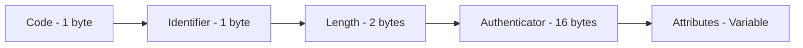

# RADIUS Packet Handling

This guide covers how to work with RADIUS packets,
attributes, and encoding/decoding in the GoRADIUS
library.

## Packet Structure

RADIUS packets follow the structure defined in
RFC 2865:



### Packet Fields

- **Code**: Identifies the packet type
  (Access-Request, Access-Accept, etc.)
- **Identifier**: Unique identifier for matching
  requests and responses
- **Length**: Total length of the packet in bytes
- **Authenticator**: 16-byte field for authentication
  and integrity
- **Attributes**: Variable-length attribute-value
  pairs

## Creating Packets

### Basic Packet Creation

```go
import "github.com/vitalvas/goradius"

// Create a new Access-Request packet
req := goradius.New(
    goradius.CodeAccessRequest, 1,
)

// Create a response packet
resp := goradius.New(
    goradius.CodeAccessAccept, req.Identifier,
)
```

### Packet Codes

```go
// Authentication packets
goradius.CodeAccessRequest     // 1
goradius.CodeAccessAccept      // 2
goradius.CodeAccessReject      // 3
goradius.CodeAccessChallenge   // 11

// Accounting packets
goradius.CodeAccountingRequest  // 4
goradius.CodeAccountingResponse // 5

// Status packets
goradius.CodeStatusServer      // 12
goradius.CodeStatusClient      // 13

// Dynamic Authorization (CoA/Disconnect)
goradius.CodeDisconnectRequest // 40
goradius.CodeDisconnectACK     // 41
goradius.CodeDisconnectNAK     // 42
goradius.CodeCoARequest        // 43
goradius.CodeCoAACK           // 44
goradius.CodeCoANAK           // 45
```

## Working with Attributes

### Adding Attributes with Dictionary

The recommended way to work with attributes is using
the dictionary-based API:

```go
import "github.com/vitalvas/goradius"

// Create packet with dictionary
dict, err := goradius.NewDefault()
if err != nil {
    log.Fatal(err)
}
req := goradius.NewWithDictionary(
    goradius.CodeAccessRequest, 1, dict,
)

// Add attributes by name
req.AddAttributeByName(
    "user-name", "john.doe",
)
req.AddAttributeByName(
    "nas-ip-address", "192.168.1.1",
)
req.AddAttributeByName("nas-port", 123)
req.AddAttributeByName(
    "framed-ip-address", "10.0.0.100",
)
req.AddAttributeByName("session-timeout", 3600)

// Tagged attributes use colon notation
req.AddAttributeByName(
    "tunnel-type:1", "vlan",
)
req.AddAttributeByName(
    "tunnel-medium-type:1", "ieee-802",
)
```

### Retrieving Attributes

```go
// Get attribute by name
usernames := req.GetAttribute("user-name")
if len(usernames) > 0 {
    fmt.Printf(
        "Username: %s\n",
        usernames[0].String(),
    )
}

// Get multiple values
replyMessages := req.GetAttribute(
    "reply-message",
)
for _, msg := range replyMessages {
    fmt.Printf("Reply: %s\n", msg.String())
}

// Get vendor attribute by name
dnsServers := req.GetAttribute(
    "erx-primary-dns",
)
if len(dnsServers) > 0 {
    fmt.Printf(
        "Primary DNS: %s\n",
        dnsServers[0].String(),
    )
}

// Get tagged attributes
tunnelTypes := req.GetAttribute("tunnel-type")
for _, tunnelType := range tunnelTypes {
    if tunnelType.Tag > 0 {
        fmt.Printf(
            "Tunnel Type (Tag %d): %s\n",
            tunnelType.Tag,
            tunnelType.String(),
        )
    }
}

// List all attribute names in the packet
attrNames := req.ListAttributes()
for _, name := range attrNames {
    fmt.Printf("Attribute: %s\n", name)
}
```

### Working with Attribute Values

The dictionary API automatically handles encoding
and decoding based on attribute type:

```go
// AttributeValue provides type-safe access
attrs := req.GetAttribute("user-name")
if len(attrs) > 0 {
    // String() works for all attribute types
    fmt.Printf(
        "Username: %s\n", attrs[0].String(),
    )

    // Access metadata
    fmt.Printf(
        "Attribute type ID: %d\n",
        attrs[0].Type,
    )
    fmt.Printf(
        "Data type: %s\n", attrs[0].DataType,
    )
    fmt.Printf("Is VSA: %t\n", attrs[0].IsVSA)
}
```

## Standard Attributes

Common RADIUS attribute types (use with dictionary
for names or reference):

```go
// Common attribute types
const (
    AttributeUserName           = 1
    AttributeUserPassword       = 2
    AttributeCHAPPassword       = 3
    AttributeNASIPAddress       = 4
    AttributeNASPort            = 5
    AttributeServiceType        = 6
    AttributeFramedProtocol     = 7
    AttributeFramedIPAddress    = 8
    AttributeFramedIPNetmask    = 9
    AttributeFramedRouting      = 10
    AttributeReplyMessage       = 18
    AttributeState              = 24
    AttributeVendorSpecific     = 26
    AttributeSessionTimeout     = 27
    AttributeIdleTimeout        = 28
    AttributeCallingStationID   = 31
    AttributeCalledStationID    = 30
    AttributeNASIdentifier      = 32
    AttributeAcctStatusType     = 40
    AttributeAcctInputOctets    = 42
    AttributeAcctOutputOctets   = 43
    AttributeAcctSessionID      = 44
    AttributeAcctSessionTime    = 46
    AttributeAcctInputPackets   = 47
    AttributeAcctOutputPackets  = 48
    AttributeAcctTerminateCause = 49
    AttributeEventTimestamp     = 55
    AttributeNASPortType        = 61
)
```

### Example Usage with Dictionary

```go
// Create packet with dictionary
dict, err := goradius.NewDefault()
if err != nil {
    log.Fatal(err)
}
req := goradius.NewWithDictionary(
    goradius.CodeAccessRequest, 1, dict,
)

// User credentials
req.AddAttributeByName(
    "user-name", "john.doe",
)
req.AddAttributeByName(
    "user-password", "secret123",
) // Will be encrypted automatically

// NAS information
req.AddAttributeByName(
    "nas-ip-address", "192.168.1.1",
)
req.AddAttributeByName("nas-port", 123)
req.AddAttributeByName(
    "nas-identifier", "nas-gateway-01",
)

// Session information
req.AddAttributeByName(
    "framed-ip-address", "10.0.0.100",
)
req.AddAttributeByName(
    "session-timeout", 3600,
)

// Accounting
req.AddAttributeByName(
    "acct-status-type", "start",
) // Uses enumerated value
req.AddAttributeByName(
    "acct-input-octets", 1024000,
)
req.AddAttributeByName(
    "acct-output-octets", 2048000,
)
```

## Vendor-Specific Attributes

### Adding VSAs with Dictionary

The recommended way to work with vendor-specific
attributes is using the dictionary API:

```go
// Add vendor attributes by name
req.AddAttributeByName(
    "erx-primary-dns", "8.8.8.8",
)
req.AddAttributeByName(
    "erx-secondary-dns", "8.8.4.4",
)

// Tagged vendor attributes use colon notation
req.AddAttributeByName(
    "erx-service-activate:1", "ipoe-parking",
)
req.AddAttributeByName(
    "erx-service-activate:2",
    "svc-ipoe-policer(52428800, 52428800)",
)

// The library automatically:
// - Looks up the vendor ID (e.g., 4874 for ERX)
// - Encodes the VSA with proper structure
// - Handles tagging if the attribute supports it
```

### Retrieving VSAs

Use the high-level dictionary API to retrieve vendor
attributes by name:

```go
// Get vendor attribute by name
dnsServers := req.GetAttribute(
    "erx-primary-dns",
)
if len(dnsServers) > 0 {
    fmt.Printf(
        "Primary DNS: %s\n",
        dnsServers[0].String(),
    )

    // Access VSA metadata if needed
    fmt.Printf(
        "Vendor ID: %d\n",
        dnsServers[0].VendorID,
    )
    fmt.Printf(
        "Vendor Type: %d\n",
        dnsServers[0].VendorType,
    )
}

// Get all vendor attributes
services := req.GetAttribute(
    "erx-service-activate",
)
for _, svc := range services {
    if svc.Tag > 0 {
        fmt.Printf(
            "Service (Tag %d): %s\n",
            svc.Tag, svc.String(),
        )
    } else {
        fmt.Printf(
            "Service: %s\n", svc.String(),
        )
    }
}

// List all attributes including VSAs
attrNames := req.ListAttributes()
for _, name := range attrNames {
    fmt.Printf("Attribute: %s\n", name)
}
```

## Packet Encoding and Decoding

### Encoding Packets

**Note: When using the server, encoding is handled
automatically. This section describes low-level
packet operations for advanced use cases.**

```go
// Create packet with dictionary
dict, err := goradius.NewDefault()
if err != nil {
    log.Fatal(err)
}
req := goradius.NewWithDictionary(
    goradius.CodeAccessRequest, 1, dict,
)

// Add attributes using dictionary API
req.AddAttributeByName(
    "user-name", "john.doe",
)
req.AddAttributeByName(
    "nas-ip-address", "192.168.1.1",
)

// Generate random authenticator
rand.Read(req.Authenticator[:])

// Encode packet to bytes
data, err := req.Encode()
if err != nil {
    log.Fatal("Failed to encode:", err)
}

fmt.Printf("Encoded packet: %x\n", data)
```

### Decoding Packets

**Note: When using the server, decoding is handled
automatically and packets are provided with a
dictionary already attached.**

```go
// Decode packet from bytes
pkt, err := goradius.Decode(data)
if err != nil {
    log.Fatal("Failed to decode:", err)
}

// Attach dictionary for attribute access
dict, err := goradius.NewDefault()
if err != nil {
    log.Fatal(err)
}
pkt.Dict = dict

// Now you can use dictionary API
usernames := pkt.GetAttribute("user-name")
if len(usernames) > 0 {
    fmt.Printf(
        "Username: %s\n",
        usernames[0].String(),
    )
}
```

### Packet Validation

```go
// Validate packet structure
if err := req.IsValid(); err != nil {
    log.Printf("Invalid packet: %v", err)
}

// Check packet code
if !req.Code.IsValid() {
    log.Printf("Invalid packet code")
}

// Validate packet length
if req.Length < goradius.MinPacketLength ||
    req.Length > goradius.MaxPacketLength {
    log.Printf(
        "Invalid packet length: %d",
        req.Length,
    )
}
```

### Authenticator Calculation

**Note: These methods are marked INTERNAL and should
not be used in application code. The server layer
handles authenticator calculation automatically.**

For advanced use cases requiring direct authenticator
manipulation, these low-level methods are available
but discouraged:

- `CalculateRequestAuthenticator()` - INTERNAL
- `CalculateResponseAuthenticator()` - INTERNAL
- `SetAuthenticator()` - INTERNAL

When using the server, authenticators are calculated
and validated automatically.

### Request/Response Matching

When using the server, responses are automatically
created with matching identifiers:

```go
// In your handler
func (h *myHandler) ServeRADIUS(
    req *goradius.Request,
) (goradius.Response, error) {
    // NewResponse automatically matches
    // the request identifier
    resp := goradius.NewResponse(req)

    // Set response code and attributes
    resp.SetCode(goradius.CodeAccessAccept)
    resp.SetAttribute(
        "reply-message", "Access granted",
    )

    // Authenticators are calculated automatically
    return resp, nil
}
```

### Packet Information

```go
// Get packet size
fmt.Printf(
    "Packet size: %d bytes\n", req.Length,
)

// Count attributes
fmt.Printf(
    "Number of attributes: %d\n",
    len(req.Attributes),
)

// Print packet info
fmt.Println(req.String())
// Output: Code=Access-Request(1), ID=1,
// Length=40, Attributes=2
```

## Packet Security

### Password Encryption

Password encryption is handled automatically when
using the dictionary API. The library supports
multiple encryption types defined in the dictionary:

```go
// User-Password encryption (RFC 2865)
secret := []byte("testing123")
authenticator := req.Authenticator
req.AddAttributeByNameWithSecret(
    "user-password", "secret123",
    secret, authenticator,
)

// Tunnel-Password encryption (RFC 2868)
req.AddAttributeByNameWithSecret(
    "tunnel-password:1", "tunnel-secret",
    secret, authenticator,
)

// Ascend-Secret encryption
req.AddAttributeByNameWithSecret(
    "ascend-secret", "ascend-secret",
    secret, authenticator,
)

// The dictionary determines the encryption type
// based on the attribute definition
```

**Note:** Direct encryption functions like
`EncryptAttributeValue()` are low-level APIs for
advanced use. The dictionary-based methods are
recommended for application code.
